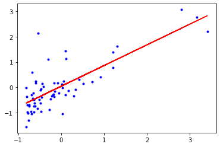
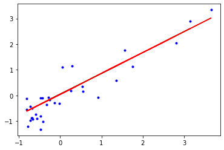

# Description

> This notebook is an implementation of **Linear Regression Algortihm** for univariate and multivariate data using Python

# reading the data


```python
import numpy as np
import pandas as pd
univariateData = np.loadtxt('univariateData.dat', delimiter = ',')
multivariateData = np.loadtxt('multivariateData.dat', delimiter = ',')
```


```python
univariateData
```


    array([[ 6.1101 , 17.592  ],
           [ 5.5277 ,  9.1302 ],
           [ 8.5186 , 13.662  ],
           [ 7.0032 , 11.854  ],
           [ 5.8598 ,  6.8233 ],
           [ 8.3829 , 11.886  ],
           [ 7.4764 ,  4.3483 ],
           [ 8.5781 , 12.     ],
           [ 6.4862 ,  6.5987 ],
           [ 5.0546 ,  3.8166 ],
           [ 5.7107 ,  3.2522 ],
           [14.164  , 15.505  ],
           [ 5.734  ,  3.1551 ],
           [ 8.4084 ,  7.2258 ],
           [ 5.6407 ,  0.71618],
           [ 5.3794 ,  3.5129 ],
           [ 6.3654 ,  5.3048 ],
           [ 5.1301 ,  0.56077],
           [ 6.4296 ,  3.6518 ],
           [ 7.0708 ,  5.3893 ],
           [ 6.1891 ,  3.1386 ],
           [20.27   , 21.767  ],
           [ 5.4901 ,  4.263  ],
           [ 6.3261 ,  5.1875 ],
           [ 5.5649 ,  3.0825 ],
           [18.945  , 22.638  ],
           [12.828  , 13.501  ],
           [10.957  ,  7.0467 ],
           [13.176  , 14.692  ],
           [22.203  , 24.147  ],
           [ 5.2524 , -1.22   ],
           [ 6.5894 ,  5.9966 ],
           [ 9.2482 , 12.134  ],
           [ 5.8918 ,  1.8495 ],
           [ 8.2111 ,  6.5426 ],
           [ 7.9334 ,  4.5623 ],
           [ 8.0959 ,  4.1164 ],
           [ 5.6063 ,  3.3928 ],
           [12.836  , 10.117  ],
           [ 6.3534 ,  5.4974 ],
           [ 5.4069 ,  0.55657],
           [ 6.8825 ,  3.9115 ],
           [11.708  ,  5.3854 ],
           [ 5.7737 ,  2.4406 ],
           [ 7.8247 ,  6.7318 ],
           [ 7.0931 ,  1.0463 ],
           [ 5.0702 ,  5.1337 ],
           [ 5.8014 ,  1.844  ],
           [11.7    ,  8.0043 ],
           [ 5.5416 ,  1.0179 ],
           [ 7.5402 ,  6.7504 ],
           [ 5.3077 ,  1.8396 ],
           [ 7.4239 ,  4.2885 ],
           [ 7.6031 ,  4.9981 ],
           [ 6.3328 ,  1.4233 ],
           [ 6.3589 , -1.4211 ],
           [ 6.2742 ,  2.4756 ],
           [ 5.6397 ,  4.6042 ],
           [ 9.3102 ,  3.9624 ],
           [ 9.4536 ,  5.4141 ],
           [ 8.8254 ,  5.1694 ],
           [ 5.1793 , -0.74279],
           [21.279  , 17.929  ],
           [14.908  , 12.054  ],
           [18.959  , 17.054  ],
           [ 7.2182 ,  4.8852 ],
           [ 8.2951 ,  5.7442 ],
           [10.236  ,  7.7754 ],
           [ 5.4994 ,  1.0173 ],
           [20.341  , 20.992  ],
           [10.136  ,  6.6799 ],
           [ 7.3345 ,  4.0259 ],
           [ 6.0062 ,  1.2784 ],
           [ 7.2259 ,  3.3411 ],
           [ 5.0269 , -2.6807 ],
           [ 6.5479 ,  0.29678],
           [ 7.5386 ,  3.8845 ],
           [ 5.0365 ,  5.7014 ],
           [10.274  ,  6.7526 ],
           [ 5.1077 ,  2.0576 ],
           [ 5.7292 ,  0.47953],
           [ 5.1884 ,  0.20421],
           [ 6.3557 ,  0.67861],
           [ 9.7687 ,  7.5435 ],
           [ 6.5159 ,  5.3436 ],
           [ 8.5172 ,  4.2415 ],
           [ 9.1802 ,  6.7981 ],
           [ 6.002  ,  0.92695],
           [ 5.5204 ,  0.152  ],
           [ 5.0594 ,  2.8214 ],
           [ 5.7077 ,  1.8451 ],
           [ 7.6366 ,  4.2959 ],
           [ 5.8707 ,  7.2029 ],
           [ 5.3054 ,  1.9869 ],
           [ 8.2934 ,  0.14454],
           [13.394  ,  9.0551 ],
           [ 5.4369 ,  0.61705]])


```python
multivariateData
```


    array([[2.10400e+03, 3.00000e+00, 3.99900e+05],
           [1.60000e+03, 3.00000e+00, 3.29900e+05],
           [2.40000e+03, 3.00000e+00, 3.69000e+05],
           [1.41600e+03, 2.00000e+00, 2.32000e+05],
           [3.00000e+03, 4.00000e+00, 5.39900e+05],
           [1.98500e+03, 4.00000e+00, 2.99900e+05],
           [1.53400e+03, 3.00000e+00, 3.14900e+05],
           [1.42700e+03, 3.00000e+00, 1.98999e+05],
           [1.38000e+03, 3.00000e+00, 2.12000e+05],
           [1.49400e+03, 3.00000e+00, 2.42500e+05],
           [1.94000e+03, 4.00000e+00, 2.39999e+05],
           [2.00000e+03, 3.00000e+00, 3.47000e+05],
           [1.89000e+03, 3.00000e+00, 3.29999e+05],
           [4.47800e+03, 5.00000e+00, 6.99900e+05],
           [1.26800e+03, 3.00000e+00, 2.59900e+05],
           [2.30000e+03, 4.00000e+00, 4.49900e+05],
           [1.32000e+03, 2.00000e+00, 2.99900e+05],
           [1.23600e+03, 3.00000e+00, 1.99900e+05],
           [2.60900e+03, 4.00000e+00, 4.99998e+05],
           [3.03100e+03, 4.00000e+00, 5.99000e+05],
           [1.76700e+03, 3.00000e+00, 2.52900e+05],
           [1.88800e+03, 2.00000e+00, 2.55000e+05],
           [1.60400e+03, 3.00000e+00, 2.42900e+05],
           [1.96200e+03, 4.00000e+00, 2.59900e+05],
           [3.89000e+03, 3.00000e+00, 5.73900e+05],
           [1.10000e+03, 3.00000e+00, 2.49900e+05],
           [1.45800e+03, 3.00000e+00, 4.64500e+05],
           [2.52600e+03, 3.00000e+00, 4.69000e+05],
           [2.20000e+03, 3.00000e+00, 4.75000e+05],
           [2.63700e+03, 3.00000e+00, 2.99900e+05],
           [1.83900e+03, 2.00000e+00, 3.49900e+05],
           [1.00000e+03, 1.00000e+00, 1.69900e+05],
           [2.04000e+03, 4.00000e+00, 3.14900e+05],
           [3.13700e+03, 3.00000e+00, 5.79900e+05],
           [1.81100e+03, 4.00000e+00, 2.85900e+05],
           [1.43700e+03, 3.00000e+00, 2.49900e+05],
           [1.23900e+03, 3.00000e+00, 2.29900e+05],
           [2.13200e+03, 4.00000e+00, 3.45000e+05],
           [4.21500e+03, 4.00000e+00, 5.49000e+05],
           [2.16200e+03, 4.00000e+00, 2.87000e+05],
           [1.66400e+03, 2.00000e+00, 3.68500e+05],
           [2.23800e+03, 3.00000e+00, 3.29900e+05],
           [2.56700e+03, 4.00000e+00, 3.14000e+05],
           [1.20000e+03, 3.00000e+00, 2.99000e+05],
           [8.52000e+02, 2.00000e+00, 1.79900e+05],
           [1.85200e+03, 4.00000e+00, 2.99900e+05],
           [1.20300e+03, 3.00000e+00, 2.39500e+05]])


# preprocessing

first we need to preprocess our data for better computations and performance
* handle the NaNs in the data, in this case we don't need this step because our data is clean already
* label encoding, in this case we don't need this step either because there're no strings in our data
* Normalizing the data, this is done here
* splitting the data, this is done bellow using **train_test_split**
* seperating data into features "X" and output "Y"
* adding column of 1's to our features "X" for both training and testing

### Normalizing the Data


```python
from sklearn.preprocessing import StandardScaler
```


```python
univariateData = StandardScaler().fit_transform(univariateData)
```


```python
multivariateData = StandardScaler().fit_transform(multivariateData)
```

### splitting the data


```python
from sklearn.model_selection import train_test_split
```


```python
uni_X = univariateData[:, :-1]
uni_y = univariateData[:, -1]
uni_X_train, uni_X_test, uni_y_train, uni_y_test = train_test_split(uni_X, uni_y, test_size = 0.33)
```


```python
multi_X = multivariateData[:, :-1]
multi_y = multivariateData[:, -1]
multi_X_train, multi_X_test, multi_y_train, multi_y_test = train_test_split(multi_X, multi_y, test_size = 0.33)
```

### attaching 1's to training features X


```python
uni_X_train = np.c_[np.ones(uni_X_train.shape[0]), uni_X_train]
uni_X_train
```


    array([[ 1.        ,  3.16404339],
           [ 1.        , -0.08704158],
           [ 1.        , -0.30042464],
           [ 1.        , -0.24257874],
           [ 1.        , -0.16135551],
           [ 1.        , -0.75519159],
           [ 1.        ,  0.03470234],
           [ 1.        , -0.61258989],
           [ 1.        , -0.61978491],
           [ 1.        , -0.40790839],
           [ 1.        ,  0.03514392],
           [ 1.        , -0.48978099],
           [ 1.        , -0.70726806],
           [ 1.        ,  0.10865262],
           [ 1.        , -0.44941614],
           [ 1.        ,  0.4179087 ],
           [ 1.        , -0.51188555],
           [ 1.        ,  3.40768709],
           [ 1.        ,  0.06457337],
           [ 1.        , -0.74142494],
           [ 1.        , -0.63009691],
           [ 1.        ,  1.214634  ],
           [ 1.        , -0.17751184],
           [ 1.        ,  0.33606207],
           [ 1.        , -0.14460176],
           [ 1.        , -0.79277713],
           [ 1.        ,  0.72656735],
           [ 1.        , -0.19114862],
           [ 1.        , -0.46861152],
           [ 1.        , -0.6313437 ],
           [ 1.        , -0.78695878],
           [ 1.        ,  0.09283397],
           [ 1.        , -0.46920894],
           [ 1.        , -0.4347144 ],
           [ 1.        ,  0.01332508],
           [ 1.        , -0.8112712 ],
           [ 1.        ,  1.30294835],
           [ 1.        , -0.81376478],
           [ 1.        , -0.27707328],
           [ 1.        , -0.5974206 ],
           [ 1.        , -0.16093991],
           [ 1.        ,  0.09319761],
           [ 1.        , -0.74082752],
           [ 1.        , -0.05880697],
           [ 1.        , -0.2143701 ],
           [ 1.        , -0.68368294],
           [ 1.        , -0.77181546],
           [ 1.        , -0.59458934],
           [ 1.        ,  1.21255602],
           [ 1.        ,  0.51331417],
           [ 1.        , -0.6855791 ],
           [ 1.        ,  0.17288833],
           [ 1.        , -0.55939348],
           [ 1.        , -0.65459115],
           [ 1.        , -0.69344947],
           [ 1.        , -0.53240565],
           [ 1.        ,  2.80143506],
           [ 1.        , -0.66326674],
           [ 1.        , -0.47630007],
           [ 1.        ,  0.91956017],
           [ 1.        , -0.63692828],
           [ 1.        ,  0.2988142 ],
           [ 1.        , -0.63614904],
           [ 1.        , -0.80656976]])


```python
uni_X_test = np.c_[np.ones(uni_X_test.shape[0]), uni_X_test]
uni_X_test
```


    array([[ 1.        , -0.0165979 ],
           [ 1.        ,  0.5491594 ],
           [ 1.        , -0.28286567],
           [ 1.        ,  0.53928898],
           [ 1.        , -0.80532297],
           [ 1.        , -0.56048442],
           [ 1.        , -0.2445788 ],
           [ 1.        ,  1.75283204],
           [ 1.        , -0.46778033],
           [ 1.        , -0.67402031],
           [ 1.        ,  0.92163816],
           [ 1.        , -0.47455975],
           [ 1.        , -0.42699988],
           [ 1.        , -0.33177623],
           [ 1.        , -0.80251769],
           [ 1.        ,  3.14560127],
           [ 1.        , -0.1359002 ],
           [ 1.        ,  3.64769432],
           [ 1.        , -0.68007244],
           [ 1.        ,  0.26504695],
           [ 1.        ,  1.35957343],
           [ 1.        , -0.69103381],
           [ 1.        , -0.41868794],
           [ 1.        , -0.58910866],
           [ 1.        , -0.6543314 ],
           [ 1.        , -0.77417917],
           [ 1.        , -0.71506051],
           [ 1.        ,  2.80507153],
           [ 1.        , -0.72220358],
           [ 1.        ,  0.28270982],
           [ 1.        , -0.46609197],
           [ 1.        ,  0.0579498 ],
           [ 1.        ,  1.55957946]])


```python
multi_X_train = np.c_[np.ones((multi_X_train.shape[0], 1)), multi_X_train]
multi_X_train
```


    array([[ 1.00000000e+00, -8.65999486e-04, -2.26093368e-01],
           [ 1.00000000e+00, -7.43677059e-01, -1.55439190e+00],
           [ 1.00000000e+00,  8.09357707e-01, -2.26093368e-01],
           [ 1.00000000e+00, -7.71822042e-02,  1.10220517e+00],
           [ 1.00000000e+00, -4.91995958e-02,  1.10220517e+00],
           [ 1.00000000e+00,  2.81647389e+00,  1.10220517e+00],
           [ 1.00000000e+00,  7.73743478e-01,  1.10220517e+00],
           [ 1.00000000e+00,  2.53521350e-01, -2.26093368e-01],
           [ 1.00000000e+00, -7.16966387e-01, -2.26093368e-01],
           [ 1.00000000e+00,  2.05187753e-01,  1.10220517e+00],
           [ 1.00000000e+00, -4.28236746e-01, -1.55439190e+00],
           [ 1.00000000e+00, -1.89112638e-01,  1.10220517e+00],
           [ 1.00000000e+00, -1.27280274e+00, -2.88269044e+00],
           [ 1.00000000e+00, -7.89466782e-01, -2.26093368e-01],
           [ 1.00000000e+00,  5.00114703e-02,  1.10220517e+00],
           [ 1.00000000e+00, -1.01841540e+00, -2.26093368e-01],
           [ 1.00000000e+00, -6.44465993e-01, -2.26093368e-01],
           [ 1.00000000e+00,  2.40309445e+00, -2.26093368e-01],
           [ 1.00000000e+00, -5.04552951e-01, -2.26093368e-01],
           [ 1.00000000e+00,  7.20322135e-01,  1.10220517e+00],
           [ 1.00000000e+00,  3.01854946e-01, -2.26093368e-01],
           [ 1.00000000e+00,  1.27107075e+00,  1.10220517e+00],
           [ 1.00000000e+00, -6.90255715e-01, -2.26093368e-01],
           [ 1.00000000e+00, -8.65782986e-01, -1.55439190e+00],
           [ 1.00000000e+00, -5.93588523e-01, -2.26093368e-01],
           [ 1.00000000e+00, -2.41262044e-01,  1.10220517e+00],
           [ 1.00000000e+00, -5.09640698e-01, -2.26093368e-01],
           [ 1.00000000e+00, -1.46104938e+00, -1.55439190e+00],
           [ 1.00000000e+00, -2.97227261e-01, -2.26093368e-01],
           [ 1.00000000e+00,  1.67029651e-01,  1.10220517e+00],
           [ 1.00000000e+00, -9.68809863e-01, -2.26093368e-01]])


```python
multi_X_test = np.c_[np.ones((multi_X_test.shape[0],1)), multi_X_test]
multi_X_test
```


    array([[ 1.        ,  0.5079087 , -0.22609337],
           [ 1.        ,  1.44532608, -0.22609337],
           [ 1.        , -0.9319237 , -0.22609337],
           [ 1.        ,  0.38071502,  1.10220517],
           [ 1.        , -0.72968575, -0.22609337],
           [ 1.        , -0.01994505,  1.10220517],
           [ 1.        , -0.14332291, -1.5543919 ],
           [ 1.        , -0.14077904, -0.22609337],
           [ 1.        , -0.97262567, -0.22609337],
           [ 1.        ,  0.66817273, -0.22609337],
           [ 1.        ,  0.13141542, -0.22609337],
           [ 1.        ,  1.31050078,  1.10220517],
           [ 1.        , -1.14560907, -0.22609337],
           [ 1.        , -0.20564782, -1.5543919 ],
           [ 1.        , -1.01459959, -0.22609337],
           [ 1.        ,  3.15099326,  2.4305037 ]])


# Linear Regression

### setting hyperParameters


```python
eta = 0.01
n_iterations = 1000
```

### Implementation


```python
def cost(X, y, weights):
    return (X.dot(weights) - y.reshape((X.shape[0],1))).T.dot(X.dot(weights) - y.reshape((X.shape[0],1)))
```


```python
def gradients(X, y, weights):
    return (2/X.shape[0]) * (X.T.dot(X.dot(weights) - y.reshape(X.shape[0],1)))
```


```python
def Batch_grad_descent(X, y, weights):
    print(cost(X, y, weights))
    return weights - eta * gradients(X, y, weights)
```


```python
def fit(X,y):
    weights = np.random.randn(X.shape[1], 1)
    for iteration in range(n_iterations):
        weights = Batch_grad_descent(X, y, weights)
    return weights
```


```python
def predict(X, weights):
    return X.dot(weights)
```


```python
from sklearn.metrics import mean_absolute_error
def Evaluate_Performance(X_test, y_test):
    return mean_absolute_error(y_test, predict(X_test, weights))
```

### Univariate

##### fitting


```python
weights = fit(uni_X_train, uni_y_train)
```

    [[40.74859084]]
    [[39.99403913]]
    [[39.26994747]]
    [[38.57508151]]
    [[37.90825706]]
    [[37.26833806]]
    [[36.65423462]]
    [[36.06490112]]
    [[35.4993344]]
    [[34.95657209]]
    [[34.43569087]]
    [[33.93580493]]
    [[33.45606444]]
    [[32.99565408]]
    [[32.55379161]]
    [[32.12972656]]
    [[31.72273894]]
    [[31.33213796]]
    [[30.95726087]]
    [[30.59747181]]
    [[30.25216075]]
    [[29.92074237]]
    [[29.60265513]]
    [[29.29736023]]
    [[29.00434075]]
    [[28.72310074]]
    [[28.45316433]]
    [[28.19407496]]
    [[27.9453946]]
    [[27.70670294]]
    [[27.47759671]]
    [[27.25768902]]
    [[27.04660861]]
    [[26.84399929]]
    [[26.6495193]]
    [[26.4628407]]
    [[26.28364886]]
    [[26.11164187]]
    [[25.94653006]]
    [[25.78803547]]
    [[25.63589141]]
    [[25.48984198]]
    [[25.34964163]]
    [[25.21505475]]
    [[25.08585525]]
    [[24.96182621]]
    [[24.84275946]]
    [[24.72845527]]
    [[24.61872197]]
    [[24.51337565]]
    [[24.41223982]]
    [[24.31514513]]
    [[24.22192909]]
    [[24.13243575]]
    [[24.04651548]]
    [[23.96402469]]
    [[23.88482557]]
    [[23.8087859]]
    [[23.73577879]]
    [[23.66568247]]
    [[23.59838008]]
    [[23.53375949]]
    [[23.47171309]]
    [[23.41213759]]
    [[23.3549339]]
    [[23.3000069]]
    [[23.24726532]]
    [[23.19662156]]
    [[23.14799156]]
    [[23.10129464]]
    [[23.05645337]]
    [[23.01339345]]
    [[22.97204357]]
    [[22.93233527]]
    [[22.89420288]]
    [[22.85758335]]
    [[22.82241618]]
    [[22.78864329]]
    [[22.75620896]]
    [[22.72505968]]
    [[22.69514413]]
    [[22.66641302]]
    [[22.63881905]]
    [[22.61231683]]
    [[22.5868628]]
    [[22.56241513]]
    [[22.53893367]]
    [[22.51637991]]
    [[22.49471686]]
    [[22.47390902]]
    [[22.45392233]]
    [[22.43472407]]
    [[22.41628285]]
    [[22.39856853]]
    [[22.3815522]]
    [[22.36520608]]
    [[22.34950353]]
    [[22.33441894]]
    [[22.31992777]]
    [[22.30600644]]
    [[22.29263231]]
    [[22.27978365]]
    [[22.26743961]]
    [[22.25558017]]
    [[22.2441861]]
    [[22.23323894]]
    [[22.22272099]]
    [[22.21261523]]
    [[22.20290533]]
    [[22.19357563]]
    [[22.18461106]]
    [[22.17599719]]
    [[22.16772013]]
    [[22.15976657]]
    [[22.15212372]]
    [[22.14477931]]
    [[22.13772154]]
    [[22.13093909]]
    [[22.12442111]]
    [[22.11815715]]
    [[22.1121372]]
    [[22.10635164]]
    [[22.10079122]]
    [[22.09544709]]
    [[22.09031072]]
    [[22.08537393]]
    [[22.08062888]]
    [[22.07606802]]
    [[22.0716841]]
    [[22.06747019]]
    [[22.06341959]]
    [[22.05952589]]
    [[22.05578295]]
    [[22.05218483]]
    [[22.04872587]]
    [[22.04540061]]
    [[22.04220381]]
    [[22.03913044]]
    [[22.03617566]]
    [[22.03333484]]
    [[22.03060353]]
    [[22.02797743]]
    [[22.02545244]]
    [[22.02302461]]
    [[22.02069015]]
    [[22.01844541]]
    [[22.01628689]]
    [[22.01421124]]
    [[22.01221522]]
    [[22.01029573]]
    [[22.0084498]]
    [[22.00667456]]
    [[22.00496726]]
    [[22.00332526]]
    [[22.00174603]]
    [[22.00022713]]
    [[21.99876622]]
    [[21.99736105]]
    [[21.99600945]]
    [[21.99470935]]
    [[21.99345876]]
    [[21.99225576]]
    [[21.99109852]]
    [[21.98998525]]
    [[21.98891426]]
    [[21.98788393]]
    [[21.98689267]]
    [[21.98593898]]
    [[21.98502142]]
    [[21.98413859]]
    [[21.98328916]]
    [[21.98247183]]
    [[21.98168537]]
    [[21.98092861]]
    [[21.98020038]]
    [[21.97949961]]
    [[21.97882523]]
    [[21.97817624]]
    [[21.97755166]]
    [[21.97695055]]
    [[21.97637202]]
    [[21.97581521]]
    [[21.97527927]]
    [[21.97476343]]
    [[21.97426689]]
    [[21.97378895]]
    [[21.97332887]]
    [[21.97288598]]
    [[21.97245963]]
    [[21.97204918]]
    [[21.97165404]]
    [[21.97127362]]
    [[21.97090735]]
    [[21.97055471]]
    [[21.97021518]]
    [[21.96988825]]
    [[21.96957346]]
    [[21.96927034]]
    [[21.96897844]]
    [[21.96869736]]
    [[21.96842667]]
    [[21.96816598]]
    [[21.96791492]]
    [[21.96767313]]
    [[21.96744025]]
    [[21.96721595]]
    [[21.96699991]]
    [[21.96679182]]
    [[21.96659137]]
    [[21.96639828]]
    [[21.96621227]]
    [[21.96603309]]
    [[21.96586047]]
    [[21.96569416]]
    [[21.96553394]]
    [[21.96537957]]
    [[21.96523084]]
    [[21.96508753]]
    [[21.96494944]]
    [[21.96481638]]
    [[21.96468817]]
    [[21.96456461]]
    [[21.96444554]]
    [[21.96433079]]
    [[21.96422021]]
    [[21.96411362]]
    [[21.9640109]]
    [[21.96391189]]
    [[21.96381646]]
    [[21.96372447]]
    [[21.9636358]]
    [[21.96355032]]
    [[21.96346793]]
    [[21.96338849]]
    [[21.96331191]]
    [[21.96323809]]
    [[21.9631669]]
    [[21.96309828]]
    [[21.9630321]]
    [[21.9629683]]
    [[21.96290678]]
    [[21.96284745]]
    [[21.96279024]]
    [[21.96273507]]
    [[21.96268187]]
    [[21.96263056]]
    [[21.96258107]]
    [[21.96253335]]
    [[21.96248731]]
    [[21.96244291]]
    [[21.96240008]]
    [[21.96235877]]
    [[21.96231891]]
    [[21.96228047]]
    [[21.96224338]]
    [[21.9622076]]
    [[21.96217308]]
    [[21.96213978]]
    [[21.96210765]]
    [[21.96207664]]
    [[21.96204673]]
    [[21.96201786]]
    [[21.96199001]]
    [[21.96196313]]
    [[21.96193719]]
    [[21.96191215]]
    [[21.96188799]]
    [[21.96186468]]
    [[21.96184217]]
    [[21.96182045]]
    [[21.96179949]]
    [[21.96177925]]
    [[21.96175972]]
    [[21.96174086]]
    [[21.96172266]]
    [[21.96170509]]
    [[21.96168812]]
    [[21.96167175]]
    [[21.96165593]]
    [[21.96164067]]
    [[21.96162593]]
    [[21.96161169]]
    [[21.96159795]]
    [[21.96158468]]
    [[21.96157186]]
    [[21.96155949]]
    [[21.96154754]]
    [[21.96153599]]
    [[21.96152485]]
    [[21.96151408]]
    [[21.96150368]]
    [[21.96149364]]
    [[21.96148394]]
    [[21.96147457]]
    [[21.96146552]]
    [[21.96145677]]
    [[21.96144833]]
    [[21.96144017]]
    [[21.96143228]]
    [[21.96142467]]
    [[21.96141731]]
    [[21.9614102]]
    [[21.96140333]]
    [[21.9613967]]
    [[21.96139028]]
    [[21.96138409]]
    [[21.9613781]]
    [[21.96137231]]
    [[21.96136672]]
    [[21.96136131]]
    [[21.96135609]]
    [[21.96135104]]
    [[21.96134617]]
    [[21.96134145]]
    [[21.96133689]]
    [[21.96133249]]
    [[21.96132823]]
    [[21.96132411]]
    [[21.96132013]]
    [[21.96131629]]
    [[21.96131257]]
    [[21.96130898]]
    [[21.9613055]]
    [[21.96130214]]
    [[21.96129889]]
    [[21.96129575]]
    [[21.96129271]]
    [[21.96128978]]
    [[21.96128694]]
    [[21.96128419]]
    [[21.96128154]]
    [[21.96127897]]
    [[21.96127649]]
    [[21.96127409]]
    [[21.96127177]]
    [[21.96126952]]
    [[21.96126735]]
    [[21.96126525]]
    [[21.96126322]]
    [[21.96126125]]
    [[21.96125935]]
    [[21.96125751]]
    [[21.96125574]]
    [[21.96125402]]
    [[21.96125235]]
    [[21.96125074]]
    [[21.96124919]]
    [[21.96124768]]
    [[21.96124622]]
    [[21.96124481]]
    [[21.96124345]]
    [[21.96124213]]
    [[21.96124085]]
    [[21.96123962]]
    [[21.96123842]]
    [[21.96123726]]
    [[21.96123614]]
    [[21.96123506]]
    [[21.96123401]]
    [[21.961233]]
    [[21.96123202]]
    [[21.96123107]]
    [[21.96123015]]
    [[21.96122926]]
    [[21.9612284]]
    [[21.96122756]]
    [[21.96122676]]
    [[21.96122598]]
    [[21.96122522]]
    [[21.96122449]]
    [[21.96122378]]
    [[21.9612231]]
    [[21.96122243]]
    [[21.96122179]]
    [[21.96122117]]
    [[21.96122057]]
    [[21.96121999]]
    [[21.96121942]]
    [[21.96121888]]
    [[21.96121835]]
    [[21.96121784]]
    [[21.96121734]]
    [[21.96121686]]
    [[21.9612164]]
    [[21.96121595]]
    [[21.96121551]]
    [[21.96121509]]
    [[21.96121469]]
    [[21.96121429]]
    [[21.96121391]]
    [[21.96121354]]
    [[21.96121318]]
    [[21.96121283]]
    [[21.9612125]]
    [[21.96121217]]
    [[21.96121185]]
    [[21.96121155]]
    [[21.96121125]]
    [[21.96121097]]
    [[21.96121069]]
    [[21.96121042]]
    [[21.96121016]]
    [[21.96120991]]
    [[21.96120966]]
    [[21.96120943]]
    [[21.9612092]]
    [[21.96120898]]
    [[21.96120876]]
    [[21.96120855]]
    [[21.96120835]]
    [[21.96120816]]
    [[21.96120797]]
    [[21.96120778]]
    [[21.96120761]]
    [[21.96120743]]
    [[21.96120727]]
    [[21.96120711]]
    [[21.96120695]]
    [[21.9612068]]
    [[21.96120665]]
    [[21.96120651]]
    [[21.96120637]]
    [[21.96120624]]
    [[21.96120611]]
    [[21.96120598]]
    [[21.96120586]]
    [[21.96120575]]
    [[21.96120563]]
    [[21.96120552]]
    [[21.96120541]]
    [[21.96120531]]
    [[21.96120521]]
    [[21.96120511]]
    [[21.96120502]]
    [[21.96120493]]
    [[21.96120484]]
    [[21.96120475]]
    [[21.96120467]]
    [[21.96120459]]
    [[21.96120451]]
    [[21.96120444]]
    [[21.96120436]]
    [[21.96120429]]
    [[21.96120422]]
    [[21.96120416]]
    [[21.96120409]]
    [[21.96120403]]
    [[21.96120397]]
    [[21.96120391]]
    [[21.96120385]]
    [[21.9612038]]
    [[21.96120374]]
    [[21.96120369]]
    [[21.96120364]]
    [[21.96120359]]
    [[21.96120355]]
    [[21.9612035]]
    [[21.96120346]]
    [[21.96120341]]
    [[21.96120337]]
    [[21.96120333]]
    [[21.96120329]]
    [[21.96120325]]
    [[21.96120322]]
    [[21.96120318]]
    [[21.96120315]]
    [[21.96120311]]
    [[21.96120308]]
    [[21.96120305]]
    [[21.96120302]]
    [[21.96120299]]
    [[21.96120296]]
    [[21.96120293]]
    [[21.96120291]]
    [[21.96120288]]
    [[21.96120285]]
    [[21.96120283]]
    [[21.96120281]]
    [[21.96120278]]
    [[21.96120276]]
    [[21.96120274]]
    [[21.96120272]]
    [[21.9612027]]
    [[21.96120268]]
    [[21.96120266]]
    [[21.96120264]]
    [[21.96120262]]
    [[21.9612026]]
    [[21.96120259]]
    [[21.96120257]]
    [[21.96120255]]
    [[21.96120254]]
    [[21.96120252]]
    [[21.96120251]]
    [[21.9612025]]
    [[21.96120248]]
    [[21.96120247]]
    [[21.96120246]]
    [[21.96120244]]
    [[21.96120243]]
    [[21.96120242]]
    [[21.96120241]]
    [[21.9612024]]
    [[21.96120239]]
    [[21.96120238]]
    [[21.96120237]]
    [[21.96120236]]
    [[21.96120235]]
    [[21.96120234]]
    [[21.96120233]]
    [[21.96120232]]
    [[21.96120231]]
    [[21.9612023]]
    [[21.9612023]]
    [[21.96120229]]
    [[21.96120228]]
    [[21.96120227]]
    [[21.96120227]]
    [[21.96120226]]
    [[21.96120225]]
    [[21.96120225]]
    [[21.96120224]]
    [[21.96120224]]
    [[21.96120223]]
    [[21.96120222]]
    [[21.96120222]]
    [[21.96120221]]
    [[21.96120221]]
    [[21.9612022]]
    [[21.9612022]]
    [[21.96120219]]
    [[21.96120219]]
    [[21.96120219]]
    [[21.96120218]]
    [[21.96120218]]
    [[21.96120217]]
    [[21.96120217]]
    [[21.96120217]]
    [[21.96120216]]
    [[21.96120216]]
    [[21.96120216]]
    [[21.96120215]]
    [[21.96120215]]
    [[21.96120215]]
    [[21.96120214]]
    [[21.96120214]]
    [[21.96120214]]
    [[21.96120213]]
    [[21.96120213]]
    [[21.96120213]]
    [[21.96120213]]
    [[21.96120212]]
    [[21.96120212]]
    [[21.96120212]]
    [[21.96120212]]
    [[21.96120211]]
    [[21.96120211]]
    [[21.96120211]]
    [[21.96120211]]
    [[21.96120211]]
    [[21.9612021]]
    [[21.9612021]]
    [[21.9612021]]
    [[21.9612021]]
    [[21.9612021]]
    [[21.9612021]]
    [[21.96120209]]
    [[21.96120209]]
    [[21.96120209]]
    [[21.96120209]]
    [[21.96120209]]
    [[21.96120209]]
    [[21.96120209]]
    [[21.96120209]]
    [[21.96120208]]
    [[21.96120208]]
    [[21.96120208]]
    [[21.96120208]]
    [[21.96120208]]
    [[21.96120208]]
    [[21.96120208]]
    [[21.96120208]]
    [[21.96120208]]
    [[21.96120207]]
    [[21.96120207]]
    [[21.96120207]]
    [[21.96120207]]
    [[21.96120207]]
    [[21.96120207]]
    [[21.96120207]]
    [[21.96120207]]
    [[21.96120207]]
    [[21.96120207]]
    [[21.96120207]]
    [[21.96120207]]
    [[21.96120207]]
    [[21.96120207]]
    [[21.96120206]]
    [[21.96120206]]
    [[21.96120206]]
    [[21.96120206]]
    [[21.96120206]]
    [[21.96120206]]
    [[21.96120206]]
    [[21.96120206]]
    [[21.96120206]]
    [[21.96120206]]
    [[21.96120206]]
    [[21.96120206]]
    [[21.96120206]]
    [[21.96120206]]
    [[21.96120206]]
    [[21.96120206]]
    [[21.96120206]]
    [[21.96120206]]
    [[21.96120206]]
    [[21.96120206]]
    [[21.96120206]]
    [[21.96120206]]
    [[21.96120206]]
    [[21.96120205]]
    [[21.96120205]]
    [[21.96120205]]
    [[21.96120205]]
    [[21.96120205]]
    [[21.96120205]]
    [[21.96120205]]
    [[21.96120205]]
    [[21.96120205]]
    [[21.96120205]]
    [[21.96120205]]
    [[21.96120205]]
    [[21.96120205]]
    [[21.96120205]]
    [[21.96120205]]
    [[21.96120205]]
    [[21.96120205]]
    [[21.96120205]]
    [[21.96120205]]
    [[21.96120205]]
    [[21.96120205]]
    [[21.96120205]]
    [[21.96120205]]
    [[21.96120205]]
    [[21.96120205]]
    [[21.96120205]]
    [[21.96120205]]
    [[21.96120205]]
    [[21.96120205]]
    [[21.96120205]]
    [[21.96120205]]
    [[21.96120205]]
    [[21.96120205]]
    [[21.96120205]]
    [[21.96120205]]
    [[21.96120205]]
    [[21.96120205]]
    [[21.96120205]]
    [[21.96120205]]
    [[21.96120205]]
    [[21.96120205]]
    [[21.96120205]]
    [[21.96120205]]
    [[21.96120205]]
    [[21.96120205]]
    [[21.96120205]]
    [[21.96120205]]
    [[21.96120205]]
    [[21.96120205]]
    [[21.96120205]]
    [[21.96120205]]
    [[21.96120205]]
    [[21.96120205]]
    [[21.96120205]]
    [[21.96120205]]
    [[21.96120205]]
    [[21.96120205]]
    [[21.96120205]]
    [[21.96120205]]
    [[21.96120205]]
    [[21.96120205]]
    [[21.96120205]]
    [[21.96120205]]
    [[21.96120205]]
    [[21.96120205]]
    [[21.96120205]]
    [[21.96120205]]
    [[21.96120205]]
    [[21.96120205]]
    [[21.96120205]]
    [[21.96120205]]
    [[21.96120205]]
    [[21.96120205]]
    [[21.96120205]]
    [[21.96120205]]
    [[21.96120205]]
    [[21.96120205]]
    [[21.96120205]]
    [[21.96120205]]
    [[21.96120205]]
    [[21.96120205]]
    [[21.96120205]]
    [[21.96120205]]
    [[21.96120205]]
    [[21.96120205]]
    [[21.96120205]]
    [[21.96120205]]
    [[21.96120205]]
    [[21.96120205]]
    [[21.96120205]]
    [[21.96120205]]
    [[21.96120205]]
    [[21.96120205]]
    [[21.96120205]]
    [[21.96120205]]
    [[21.96120205]]
    [[21.96120205]]
    [[21.96120205]]
    [[21.96120205]]
    [[21.96120205]]
    [[21.96120205]]
    [[21.96120205]]
    [[21.96120205]]
    [[21.96120205]]
    [[21.96120205]]
    [[21.96120205]]
    [[21.96120205]]
    [[21.96120205]]
    [[21.96120205]]
    [[21.96120205]]
    [[21.96120205]]
    [[21.96120205]]
    [[21.96120205]]
    [[21.96120205]]
    [[21.96120205]]
    [[21.96120205]]
    [[21.96120205]]
    [[21.96120205]]
    [[21.96120205]]
    [[21.96120205]]
    [[21.96120205]]
    [[21.96120205]]
    [[21.96120205]]
    [[21.96120205]]
    [[21.96120205]]
    [[21.96120205]]
    [[21.96120205]]
    [[21.96120205]]
    [[21.96120205]]
    [[21.96120205]]
    [[21.96120205]]
    [[21.96120205]]
    [[21.96120205]]
    [[21.96120205]]
    [[21.96120205]]
    [[21.96120205]]
    [[21.96120205]]
    [[21.96120205]]
    [[21.96120205]]
    [[21.96120205]]
    [[21.96120205]]
    [[21.96120205]]
    [[21.96120205]]
    [[21.96120205]]
    [[21.96120205]]
    [[21.96120205]]
    [[21.96120205]]
    [[21.96120205]]
    [[21.96120205]]
    [[21.96120205]]
    [[21.96120205]]
    [[21.96120205]]
    [[21.96120205]]
    [[21.96120205]]
    [[21.96120205]]
    [[21.96120205]]
    [[21.96120205]]
    [[21.96120205]]
    [[21.96120205]]
    [[21.96120205]]
    [[21.96120205]]
    [[21.96120205]]
    [[21.96120205]]
    [[21.96120205]]
    [[21.96120205]]
    [[21.96120205]]
    [[21.96120205]]
    [[21.96120205]]
    [[21.96120205]]
    [[21.96120205]]
    [[21.96120205]]
    [[21.96120205]]
    [[21.96120205]]
    [[21.96120205]]
    [[21.96120205]]
    [[21.96120205]]
    [[21.96120205]]
    [[21.96120205]]
    [[21.96120205]]
    [[21.96120205]]
    [[21.96120205]]
    [[21.96120205]]
    [[21.96120205]]
    [[21.96120205]]
    [[21.96120205]]
    [[21.96120205]]
    [[21.96120205]]
    [[21.96120205]]
    [[21.96120205]]
    [[21.96120205]]
    [[21.96120205]]
    [[21.96120205]]
    [[21.96120205]]
    [[21.96120205]]
    [[21.96120205]]
    [[21.96120205]]
    [[21.96120205]]
    [[21.96120205]]
    [[21.96120205]]
    [[21.96120205]]
    [[21.96120205]]
    [[21.96120205]]
    [[21.96120205]]
    [[21.96120205]]
    [[21.96120205]]
    [[21.96120205]]
    [[21.96120205]]
    [[21.96120205]]
    [[21.96120205]]
    [[21.96120205]]
    [[21.96120205]]
    [[21.96120205]]
    [[21.96120205]]
    [[21.96120205]]
    [[21.96120205]]
    [[21.96120205]]
    [[21.96120205]]
    [[21.96120205]]
    [[21.96120205]]
    [[21.96120205]]
    [[21.96120205]]
    [[21.96120205]]
    [[21.96120205]]
    [[21.96120205]]
    [[21.96120205]]
    [[21.96120205]]
    [[21.96120205]]
    [[21.96120205]]
    [[21.96120205]]
    [[21.96120205]]
    [[21.96120205]]
    [[21.96120205]]
    [[21.96120205]]
    [[21.96120205]]
    [[21.96120205]]
    [[21.96120205]]
    [[21.96120205]]
    [[21.96120205]]
    [[21.96120205]]
    [[21.96120205]]
    [[21.96120205]]
    [[21.96120205]]
    [[21.96120205]]
    [[21.96120205]]
    [[21.96120205]]
    [[21.96120205]]
    [[21.96120205]]
    [[21.96120205]]
    [[21.96120205]]
    [[21.96120205]]
    [[21.96120205]]
    [[21.96120205]]
    [[21.96120205]]
    [[21.96120205]]
    [[21.96120205]]
    [[21.96120205]]
    [[21.96120205]]
    [[21.96120205]]
    [[21.96120205]]
    [[21.96120205]]
    [[21.96120205]]
    [[21.96120205]]
    [[21.96120205]]
    [[21.96120205]]
    [[21.96120205]]
    [[21.96120205]]
    [[21.96120205]]
    [[21.96120205]]
    [[21.96120205]]
    [[21.96120205]]
    [[21.96120205]]
    [[21.96120205]]
    [[21.96120205]]
    [[21.96120205]]
    [[21.96120205]]
    [[21.96120205]]
    [[21.96120205]]
    [[21.96120205]]
    [[21.96120205]]
    [[21.96120205]]
    [[21.96120205]]
    [[21.96120205]]
    [[21.96120205]]
    [[21.96120205]]
    [[21.96120205]]
    [[21.96120205]]
    [[21.96120205]]
    [[21.96120205]]
    [[21.96120205]]
    [[21.96120205]]
    [[21.96120205]]
    [[21.96120205]]
    [[21.96120205]]
    [[21.96120205]]
    [[21.96120205]]
    [[21.96120205]]
    [[21.96120205]]
    [[21.96120205]]
    [[21.96120205]]
    [[21.96120205]]
    [[21.96120205]]
    [[21.96120205]]
    [[21.96120205]]
    [[21.96120205]]
    [[21.96120205]]
    [[21.96120205]]
    [[21.96120205]]
    [[21.96120205]]
    [[21.96120205]]
    [[21.96120205]]
    [[21.96120205]]
    [[21.96120205]]
    [[21.96120205]]
    [[21.96120205]]
    [[21.96120205]]
    [[21.96120205]]
    [[21.96120205]]
    [[21.96120205]]
    [[21.96120205]]
    [[21.96120205]]
    [[21.96120205]]
    [[21.96120205]]
    [[21.96120205]]
    [[21.96120205]]
    [[21.96120205]]
    [[21.96120205]]
    [[21.96120205]]
    [[21.96120205]]
    [[21.96120205]]
    [[21.96120205]]
    [[21.96120205]]
    [[21.96120205]]
    [[21.96120205]]
    [[21.96120205]]
    [[21.96120205]]
    [[21.96120205]]
    [[21.96120205]]
    [[21.96120205]]
    [[21.96120205]]
    [[21.96120205]]
    [[21.96120205]]
    [[21.96120205]]
    [[21.96120205]]
    [[21.96120205]]
    [[21.96120205]]
    [[21.96120205]]
    [[21.96120205]]
    [[21.96120205]]
    [[21.96120205]]
    [[21.96120205]]
    [[21.96120205]]
    [[21.96120205]]
    [[21.96120205]]
    [[21.96120205]]
    [[21.96120205]]
    [[21.96120205]]
    [[21.96120205]]
    [[21.96120205]]
    [[21.96120205]]
    [[21.96120205]]
    [[21.96120205]]
    [[21.96120205]]
    [[21.96120205]]
    [[21.96120205]]
    [[21.96120205]]
    [[21.96120205]]
    [[21.96120205]]
    [[21.96120205]]
    [[21.96120205]]
    [[21.96120205]]
    [[21.96120205]]
    [[21.96120205]]
    [[21.96120205]]
    [[21.96120205]]
    [[21.96120205]]
    [[21.96120205]]
    [[21.96120205]]
    [[21.96120205]]
    [[21.96120205]]
    [[21.96120205]]
    


```python
weights
```


    array([[0.04431296],
           [0.81546236]])


##### visualization


```python
import matplotlib.pyplot as plt
plt.plot(uni_X_train[:,1], uni_y_train,'b.')
plt.plot(uni_X_train[:,1], predict(uni_X_train, weights), 'r-')
plt.show()
```


    

    


##### evaluation

plotting resulting model with testing data


```python
plt.plot(uni_X_test[:,1], uni_y_test,'b.')
plt.plot(uni_X_test[:,1], predict(uni_X_test, weights), 'r-')
plt.show()
```


    

    


using Mean absolute error metric from sklearn metrics


```python
Evaluate_Performance(uni_X_test, uni_y_test)
```


    0.3830613373382408


### Multivariate

##### fitting


```python
weights = fit(multi_X_train, multi_y_train)
```

    [[168.43874902]]
    [[159.60931681]]
    [[151.28339569]]
    [[143.43191576]]
    [[136.02749475]]
    [[129.04433973]]
    [[122.45815462]]
    [[116.24605307]]
    [[110.38647635]]
    [[104.85911618]]
    [[99.6448419]]
    [[94.72563198]]
    [[90.0845095]]
    [[85.70548138]]
    [[81.57348117]]
    [[77.67431514]]
    [[73.99461159]]
    [[70.52177297]]
    [[67.24393098]]
    [[64.14990409]]
    [[61.22915771]]
    [[58.47176656]]
    [[55.86837924]]
    [[53.41018498]]
    [[51.08888215]]
    [[48.89664875]]
    [[46.82611456]]
    [[44.87033488]]
    [[43.02276586]]
    [[41.27724124]]
    [[39.62795044]]
    [[38.06941789]]
    [[36.59648368]]
    [[35.20428517]]
    [[33.8882398]]
    [[32.64402887]]
    [[31.4675822]]
    [[30.35506377]]
    [[29.30285815]]
    [[28.30755772]]
    [[27.36595061]]
    [[26.47500944]]
    [[25.63188055]]
    [[24.83387403]]
    [[24.07845421]]
    [[23.36323073]]
    [[22.68595016]]
    [[22.04448809]]
    [[21.43684166]]
    [[20.86112254]]
    [[20.31555031]]
    [[19.79844626]]
    [[19.30822748]]
    [[18.84340137]]
    [[18.4025604]]
    [[17.98437722]]
    [[17.58760005]]
    [[17.2110483]]
    [[16.85360849]]
    [[16.51423037]]
    [[16.19192331]]
    [[15.88575282]]
    [[15.59483738]]
    [[15.31834536]]
    [[15.05549215]]
    [[14.80553748]]
    [[14.56778286]]
    [[14.34156919]]
    [[14.1262745]]
    [[13.92131181]]
    [[13.72612715]]
    [[13.54019763]]
    [[13.36302972]]
    [[13.19415751]]
    [[13.03314116]]
    [[12.87956541]]
    [[12.73303818]]
    [[12.59318922]]
    [[12.45966892]]
    [[12.33214706]]
    [[12.21031177]]
    [[12.09386844]]
    [[11.98253879]]
    [[11.87605987]]
    [[11.77418326]]
    [[11.67667419]]
    [[11.5833108]]
    [[11.49388341]]
    [[11.40819381]]
    [[11.3260546]]
    [[11.24728863]]
    [[11.17172836]]
    [[11.09921538]]
    [[11.02959984]]
    [[10.96274]]
    [[10.89850175]]
    [[10.83675822]]
    [[10.77738933]]
    [[10.72028143]]
    [[10.66532696]]
    [[10.61242405]]
    [[10.56147628]]
    [[10.51239231]]
    [[10.46508563]]
    [[10.41947428]]
    [[10.37548061]]
    [[10.33303102]]
    [[10.29205575]]
    [[10.25248868]]
    [[10.21426709]]
    [[10.17733151]]
    [[10.14162553]]
    [[10.1070956]]
    [[10.07369094]]
    [[10.04136333]]
    [[10.01006699]]
    [[9.97975844]]
    [[9.9503964]]
    [[9.92194164]]
    [[9.89435687]]
    [[9.86760666]]
    [[9.84165731]]
    [[9.8164768]]
    [[9.79203463]]
    [[9.76830182]]
    [[9.74525074]]
    [[9.72285514]]
    [[9.70108998]]
    [[9.67993142]]
    [[9.65935676]]
    [[9.63934433]]
    [[9.61987351]]
    [[9.6009246]]
    [[9.58247883]]
    [[9.56451827]]
    [[9.54702581]]
    [[9.52998513]]
    [[9.5133806]]
    [[9.49719733]]
    [[9.48142105]]
    [[9.46603814]]
    [[9.45103556]]
    [[9.43640083]]
    [[9.42212202]]
    [[9.4081877]]
    [[9.3945869]]
    [[9.38130914]]
    [[9.36834436]]
    [[9.35568292]]
    [[9.34331556]]
    [[9.3312334]]
    [[9.31942793]]
    [[9.30789095]]
    [[9.29661461]]
    [[9.28559135]]
    [[9.2748139]]
    [[9.26427529]]
    [[9.25396878]]
    [[9.24388792]]
    [[9.23402646]]
    [[9.22437843]]
    [[9.21493802]]
    [[9.20569969]]
    [[9.19665804]]
    [[9.18780791]]
    [[9.17914429]]
    [[9.17066236]]
    [[9.16235746]]
    [[9.15422508]]
    [[9.14626089]]
    [[9.13846066]]
    [[9.13082034]]
    [[9.123336]]
    [[9.11600383]]
    [[9.10882015]]
    [[9.10178139]]
    [[9.09488409]]
    [[9.08812491]]
    [[9.08150061]]
    [[9.07500803]]
    [[9.06864414]]
    [[9.06240597]]
    [[9.05629064]]
    [[9.05029537]]
    [[9.04441746]]
    [[9.03865427]]
    [[9.03300325]]
    [[9.02746192]]
    [[9.02202786]]
    [[9.01669873]]
    [[9.01147225]]
    [[9.00634619]]
    [[9.0013184]]
    [[8.99638676]]
    [[8.99154925]]
    [[8.98680385]]
    [[8.98214863]]
    [[8.9775817]]
    [[8.97310121]]
    [[8.96870537]]
    [[8.96439241]]
    [[8.96016065]]
    [[8.9560084]]
    [[8.95193405]]
    [[8.94793601]]
    [[8.94401272]]
    [[8.94016269]]
    [[8.93638443]]
    [[8.9326765]]
    [[8.92903751]]
    [[8.92546607]]
    [[8.92196085]]
    [[8.91852053]]
    [[8.91514383]]
    [[8.91182951]]
    [[8.90857633]]
    [[8.90538311]]
    [[8.90224867]]
    [[8.89917187]]
    [[8.89615159]]
    [[8.89318673]]
    [[8.89027624]]
    [[8.88741905]]
    [[8.88461415]]
    [[8.88186054]]
    [[8.87915723]]
    [[8.87650326]]
    [[8.87389769]]
    [[8.8713396]]
    [[8.8688281]]
    [[8.86636229]]
    [[8.86394132]]
    [[8.86156434]]
    [[8.85923052]]
    [[8.85693905]]
    [[8.85468913]]
    [[8.85247999]]
    [[8.85031086]]
    [[8.848181]]
    [[8.84608967]]
    [[8.84403615]]
    [[8.84201974]]
    [[8.84003975]]
    [[8.83809551]]
    [[8.83618635]]
    [[8.83431163]]
    [[8.8324707]]
    [[8.83066294]]
    [[8.82888774]]
    [[8.8271445]]
    [[8.82543263]]
    [[8.82375156]]
    [[8.82210072]]
    [[8.82047955]]
    [[8.81888751]]
    [[8.81732407]]
    [[8.8157887]]
    [[8.81428089]]
    [[8.81280013]]
    [[8.81134594]]
    [[8.80991782]]
    [[8.80851531]]
    [[8.80713793]]
    [[8.80578523]]
    [[8.80445676]]
    [[8.80315208]]
    [[8.80187076]]
    [[8.80061237]]
    [[8.79937649]]
    [[8.79816273]]
    [[8.79697067]]
    [[8.79579992]]
    [[8.79465011]]
    [[8.79352084]]
    [[8.79241175]]
    [[8.79132248]]
    [[8.79025267]]
    [[8.78920195]]
    [[8.78817]]
    [[8.78715647]]
    [[8.78616103]]
    [[8.78518336]]
    [[8.78422312]]
    [[8.78328002]]
    [[8.78235374]]
    [[8.78144398]]
    [[8.78055044]]
    [[8.77967283]]
    [[8.77881086]]
    [[8.77796425]]
    [[8.77713274]]
    [[8.77631603]]
    [[8.77551388]]
    [[8.77472602]]
    [[8.77395219]]
    [[8.77319214]]
    [[8.77244563]]
    [[8.7717124]]
    [[8.77099223]]
    [[8.77028489]]
    [[8.76959013]]
    [[8.76890773]]
    [[8.76823748]]
    [[8.76757915]]
    [[8.76693254]]
    [[8.76629743]]
    [[8.76567362]]
    [[8.76506091]]
    [[8.76445909]]
    [[8.76386797]]
    [[8.76328737]]
    [[8.76271709]]
    [[8.76215695]]
    [[8.76160676]]
    [[8.76106636]]
    [[8.76053557]]
    [[8.7600142]]
    [[8.75950211]]
    [[8.75899911]]
    [[8.75850506]]
    [[8.75801978]]
    [[8.75754313]]
    [[8.75707494]]
    [[8.75661508]]
    [[8.75616338]]
    [[8.7557197]]
    [[8.75528391]]
    [[8.75485586]]
    [[8.75443541]]
    [[8.75402243]]
    [[8.75361678]]
    [[8.75321834]]
    [[8.75282697]]
    [[8.75244255]]
    [[8.75206496]]
    [[8.75169407]]
    [[8.75132977]]
    [[8.75097193]]
    [[8.75062045]]
    [[8.75027521]]
    [[8.74993609]]
    [[8.749603]]
    [[8.74927582]]
    [[8.74895444]]
    [[8.74863877]]
    [[8.7483287]]
    [[8.74802414]]
    [[8.74772498]]
    [[8.74743113]]
    [[8.74714249]]
    [[8.74685898]]
    [[8.74658049]]
    [[8.74630695]]
    [[8.74603826]]
    [[8.74577434]]
    [[8.7455151]]
    [[8.74526047]]
    [[8.74501034]]
    [[8.74476466]]
    [[8.74452334]]
    [[8.74428629]]
    [[8.74405346]]
    [[8.74382475]]
    [[8.7436001]]
    [[8.74337943]]
    [[8.74316268]]
    [[8.74294978]]
    [[8.74274065]]
    [[8.74253523]]
    [[8.74233345]]
    [[8.74213525]]
    [[8.74194057]]
    [[8.74174934]]
    [[8.7415615]]
    [[8.74137699]]
    [[8.74119576]]
    [[8.74101774]]
    [[8.74084288]]
    [[8.74067111]]
    [[8.7405024]]
    [[8.74033667]]
    [[8.74017389]]
    [[8.74001399]]
    [[8.73985693]]
    [[8.73970265]]
    [[8.73955111]]
    [[8.73940225]]
    [[8.73925604]]
    [[8.73911242]]
    [[8.73897134]]
    [[8.73883276]]
    [[8.73869665]]
    [[8.73856294]]
    [[8.73843161]]
    [[8.7383026]]
    [[8.73817589]]
    [[8.73805142]]
    [[8.73792915]]
    [[8.73780906]]
    [[8.73769109]]
    [[8.73757521]]
    [[8.73746139]]
    [[8.73734959]]
    [[8.73723977]]
    [[8.73713189]]
    [[8.73702593]]
    [[8.73692185]]
    [[8.73681961]]
    [[8.73671919]]
    [[8.73662054]]
    [[8.73652364]]
    [[8.73642847]]
    [[8.73633497]]
    [[8.73624314]]
    [[8.73615293]]
    [[8.73606433]]
    [[8.73597729]]
    [[8.7358918]]
    [[8.73580782]]
    [[8.73572533]]
    [[8.73564431]]
    [[8.73556471]]
    [[8.73548654]]
    [[8.73540974]]
    [[8.73533431]]
    [[8.73526021]]
    [[8.73518743]]
    [[8.73511594]]
    [[8.73504572]]
    [[8.73497674]]
    [[8.73490898]]
    [[8.73484242]]
    [[8.73477705]]
    [[8.73471283]]
    [[8.73464975]]
    [[8.73458779]]
    [[8.73452693]]
    [[8.73446714]]
    [[8.73440842]]
    [[8.73435073]]
    [[8.73429407]]
    [[8.73423842]]
    [[8.73418375]]
    [[8.73413004]]
    [[8.7340773]]
    [[8.73402548]]
    [[8.73397458]]
    [[8.73392459]]
    [[8.73387548]]
    [[8.73382725]]
    [[8.73377986]]
    [[8.73373332]]
    [[8.7336876]]
    [[8.7336427]]
    [[8.73359858]]
    [[8.73355525]]
    [[8.73351269]]
    [[8.73347089]]
    [[8.73342982]]
    [[8.73338948]]
    [[8.73334986]]
    [[8.73331094]]
    [[8.73327271]]
    [[8.73323515]]
    [[8.73319826]]
    [[8.73316203]]
    [[8.73312644]]
    [[8.73309148]]
    [[8.73305713]]
    [[8.7330234]]
    [[8.73299027]]
    [[8.73295772]]
    [[8.73292575]]
    [[8.73289434]]
    [[8.73286349]]
    [[8.73283319]]
    [[8.73280343]]
    [[8.73277419]]
    [[8.73274547]]
    [[8.73271726]]
    [[8.73268955]]
    [[8.73266234]]
    [[8.7326356]]
    [[8.73260934]]
    [[8.73258354]]
    [[8.7325582]]
    [[8.73253331]]
    [[8.73250886]]
    [[8.73248485]]
    [[8.73246126]]
    [[8.73243808]]
    [[8.73241532]]
    [[8.73239296]]
    [[8.732371]]
    [[8.73234943]]
    [[8.73232824]]
    [[8.73230742]]
    [[8.73228698]]
    [[8.73226689]]
    [[8.73224717]]
    [[8.73222779]]
    [[8.73220875]]
    [[8.73219006]]
    [[8.73217169]]
    [[8.73215365]]
    [[8.73213593]]
    [[8.73211852]]
    [[8.73210143]]
    [[8.73208463]]
    [[8.73206813]]
    [[8.73205193]]
    [[8.73203601]]
    [[8.73202037]]
    [[8.73200502]]
    [[8.73198993]]
    [[8.73197511]]
    [[8.73196055]]
    [[8.73194625]]
    [[8.73193221]]
    [[8.73191841]]
    [[8.73190486]]
    [[8.73189155]]
    [[8.73187847]]
    [[8.73186563]]
    [[8.73185301]]
    [[8.73184062]]
    [[8.73182845]]
    [[8.73181649]]
    [[8.73180475]]
    [[8.73179321]]
    [[8.73178188]]
    [[8.73177074]]
    [[8.73175981]]
    [[8.73174907]]
    [[8.73173852]]
    [[8.73172815]]
    [[8.73171797]]
    [[8.73170798]]
    [[8.73169815]]
    [[8.7316885]]
    [[8.73167903]]
    [[8.73166972]]
    [[8.73166057]]
    [[8.73165159]]
    [[8.73164277]]
    [[8.7316341]]
    [[8.73162559]]
    [[8.73161723]]
    [[8.73160901]]
    [[8.73160094]]
    [[8.73159302]]
    [[8.73158523]]
    [[8.73157759]]
    [[8.73157008]]
    [[8.7315627]]
    [[8.73155545]]
    [[8.73154833]]
    [[8.73154134]]
    [[8.73153447]]
    [[8.73152772]]
    [[8.73152109]]
    [[8.73151458]]
    [[8.73150819]]
    [[8.73150191]]
    [[8.73149574]]
    [[8.73148968]]
    [[8.73148372]]
    [[8.73147787]]
    [[8.73147213]]
    [[8.73146649]]
    [[8.73146094]]
    [[8.7314555]]
    [[8.73145015]]
    [[8.7314449]]
    [[8.73143974]]
    [[8.73143467]]
    [[8.73142969]]
    [[8.7314248]]
    [[8.73142]]
    [[8.73141528]]
    [[8.73141064]]
    [[8.73140609]]
    [[8.73140162]]
    [[8.73139723]]
    [[8.73139291]]
    [[8.73138867]]
    [[8.73138451]]
    [[8.73138042]]
    [[8.7313764]]
    [[8.73137246]]
    [[8.73136858]]
    [[8.73136477]]
    [[8.73136103]]
    [[8.73135736]]
    [[8.73135375]]
    [[8.7313502]]
    [[8.73134672]]
    [[8.7313433]]
    [[8.73133994]]
    [[8.73133664]]
    [[8.7313334]]
    [[8.73133022]]
    [[8.73132709]]
    [[8.73132402]]
    [[8.731321]]
    [[8.73131804]]
    [[8.73131512]]
    [[8.73131226]]
    [[8.73130945]]
    [[8.73130669]]
    [[8.73130398]]
    [[8.73130132]]
    [[8.73129871]]
    [[8.73129614]]
    [[8.73129361]]
    [[8.73129113]]
    [[8.7312887]]
    [[8.73128631]]
    [[8.73128396]]
    [[8.73128165]]
    [[8.73127938]]
    [[8.73127716]]
    [[8.73127497]]
    [[8.73127282]]
    [[8.73127071]]
    [[8.73126864]]
    [[8.7312666]]
    [[8.7312646]]
    [[8.73126264]]
    [[8.73126071]]
    [[8.73125881]]
    [[8.73125695]]
    [[8.73125512]]
    [[8.73125332]]
    [[8.73125156]]
    [[8.73124982]]
    [[8.73124812]]
    [[8.73124645]]
    [[8.73124481]]
    [[8.73124319]]
    [[8.73124161]]
    [[8.73124005]]
    [[8.73123852]]
    [[8.73123702]]
    [[8.73123554]]
    [[8.73123409]]
    [[8.73123267]]
    [[8.73123127]]
    [[8.73122989]]
    [[8.73122854]]
    [[8.73122722]]
    [[8.73122592]]
    [[8.73122464]]
    [[8.73122338]]
    [[8.73122215]]
    [[8.73122093]]
    [[8.73121974]]
    [[8.73121857]]
    [[8.73121742]]
    [[8.7312163]]
    [[8.73121519]]
    [[8.7312141]]
    [[8.73121303]]
    [[8.73121198]]
    [[8.73121095]]
    [[8.73120993]]
    [[8.73120894]]
    [[8.73120796]]
    [[8.731207]]
    [[8.73120605]]
    [[8.73120513]]
    [[8.73120421]]
    [[8.73120332]]
    [[8.73120244]]
    [[8.73120158]]
    [[8.73120073]]
    [[8.7311999]]
    [[8.73119908]]
    [[8.73119828]]
    [[8.73119749]]
    [[8.73119671]]
    [[8.73119595]]
    [[8.7311952]]
    [[8.73119447]]
    [[8.73119374]]
    [[8.73119304]]
    [[8.73119234]]
    [[8.73119165]]
    [[8.73119098]]
    [[8.73119032]]
    [[8.73118967]]
    [[8.73118904]]
    [[8.73118841]]
    [[8.7311878]]
    [[8.73118719]]
    [[8.7311866]]
    [[8.73118602]]
    [[8.73118545]]
    [[8.73118488]]
    [[8.73118433]]
    [[8.73118379]]
    [[8.73118326]]
    [[8.73118273]]
    [[8.73118222]]
    [[8.73118172]]
    [[8.73118122]]
    [[8.73118073]]
    [[8.73118025]]
    [[8.73117978]]
    [[8.73117932]]
    [[8.73117887]]
    [[8.73117842]]
    [[8.73117799]]
    [[8.73117756]]
    [[8.73117713]]
    [[8.73117672]]
    [[8.73117631]]
    [[8.73117591]]
    [[8.73117552]]
    [[8.73117513]]
    [[8.73117475]]
    [[8.73117438]]
    [[8.73117402]]
    [[8.73117366]]
    [[8.7311733]]
    [[8.73117296]]
    [[8.73117262]]
    [[8.73117228]]
    [[8.73117195]]
    [[8.73117163]]
    [[8.73117131]]
    [[8.731171]]
    [[8.73117069]]
    [[8.73117039]]
    [[8.7311701]]
    [[8.73116981]]
    [[8.73116952]]
    [[8.73116924]]
    [[8.73116897]]
    [[8.7311687]]
    [[8.73116843]]
    [[8.73116817]]
    [[8.73116792]]
    [[8.73116767]]
    [[8.73116742]]
    [[8.73116718]]
    [[8.73116694]]
    [[8.7311667]]
    [[8.73116647]]
    [[8.73116625]]
    [[8.73116603]]
    [[8.73116581]]
    [[8.7311656]]
    [[8.73116539]]
    [[8.73116518]]
    [[8.73116498]]
    [[8.73116478]]
    [[8.73116458]]
    [[8.73116439]]
    [[8.7311642]]
    [[8.73116401]]
    [[8.73116383]]
    [[8.73116365]]
    [[8.73116348]]
    [[8.73116331]]
    [[8.73116314]]
    [[8.73116297]]
    [[8.73116281]]
    [[8.73116264]]
    [[8.73116249]]
    [[8.73116233]]
    [[8.73116218]]
    [[8.73116203]]
    [[8.73116188]]
    [[8.73116174]]
    [[8.7311616]]
    [[8.73116146]]
    [[8.73116132]]
    [[8.73116119]]
    [[8.73116105]]
    [[8.73116092]]
    [[8.7311608]]
    [[8.73116067]]
    [[8.73116055]]
    [[8.73116043]]
    [[8.73116031]]
    [[8.73116019]]
    [[8.73116008]]
    [[8.73115997]]
    [[8.73115986]]
    [[8.73115975]]
    [[8.73115964]]
    [[8.73115954]]
    [[8.73115943]]
    [[8.73115933]]
    [[8.73115923]]
    [[8.73115914]]
    [[8.73115904]]
    [[8.73115895]]
    [[8.73115885]]
    [[8.73115876]]
    [[8.73115867]]
    [[8.73115859]]
    [[8.7311585]]
    [[8.73115842]]
    [[8.73115833]]
    [[8.73115825]]
    [[8.73115817]]
    [[8.73115809]]
    [[8.73115802]]
    [[8.73115794]]
    [[8.73115786]]
    [[8.73115779]]
    [[8.73115772]]
    [[8.73115765]]
    [[8.73115758]]
    [[8.73115751]]
    [[8.73115744]]
    [[8.73115738]]
    [[8.73115731]]
    [[8.73115725]]
    [[8.73115719]]
    [[8.73115713]]
    [[8.73115707]]
    [[8.73115701]]
    [[8.73115695]]
    [[8.73115689]]
    [[8.73115684]]
    [[8.73115678]]
    [[8.73115673]]
    [[8.73115668]]
    [[8.73115662]]
    [[8.73115657]]
    [[8.73115652]]
    [[8.73115647]]
    [[8.73115642]]
    [[8.73115638]]
    [[8.73115633]]
    [[8.73115628]]
    [[8.73115624]]
    [[8.73115619]]
    [[8.73115615]]
    [[8.73115611]]
    [[8.73115607]]
    [[8.73115602]]
    [[8.73115598]]
    [[8.73115594]]
    [[8.7311559]]
    [[8.73115587]]
    [[8.73115583]]
    [[8.73115579]]
    [[8.73115575]]
    [[8.73115572]]
    [[8.73115568]]
    [[8.73115565]]
    [[8.73115562]]
    [[8.73115558]]
    [[8.73115555]]
    [[8.73115552]]
    [[8.73115549]]
    [[8.73115545]]
    [[8.73115542]]
    [[8.73115539]]
    [[8.73115536]]
    [[8.73115534]]
    [[8.73115531]]
    [[8.73115528]]
    [[8.73115525]]
    [[8.73115523]]
    [[8.7311552]]
    [[8.73115517]]
    [[8.73115515]]
    [[8.73115512]]
    [[8.7311551]]
    [[8.73115507]]
    [[8.73115505]]
    [[8.73115503]]
    [[8.731155]]
    [[8.73115498]]
    [[8.73115496]]
    [[8.73115494]]
    [[8.73115492]]
    [[8.7311549]]
    [[8.73115487]]
    [[8.73115485]]
    [[8.73115483]]
    [[8.73115482]]
    [[8.7311548]]
    [[8.73115478]]
    [[8.73115476]]
    [[8.73115474]]
    [[8.73115472]]
    [[8.73115471]]
    [[8.73115469]]
    [[8.73115467]]
    [[8.73115465]]
    [[8.73115464]]
    [[8.73115462]]
    [[8.73115461]]
    [[8.73115459]]
    [[8.73115458]]
    [[8.73115456]]
    [[8.73115455]]
    [[8.73115453]]
    [[8.73115452]]
    [[8.7311545]]
    [[8.73115449]]
    [[8.73115448]]
    [[8.73115446]]
    [[8.73115445]]
    [[8.73115444]]
    [[8.73115443]]
    [[8.73115441]]
    [[8.7311544]]
    [[8.73115439]]
    [[8.73115438]]
    [[8.73115437]]
    [[8.73115436]]
    [[8.73115434]]
    [[8.73115433]]
    [[8.73115432]]
    [[8.73115431]]
    [[8.7311543]]
    [[8.73115429]]
    [[8.73115428]]
    [[8.73115427]]
    [[8.73115426]]
    [[8.73115425]]
    [[8.73115424]]
    [[8.73115424]]
    [[8.73115423]]
    [[8.73115422]]
    [[8.73115421]]
    [[8.7311542]]
    [[8.73115419]]
    [[8.73115418]]
    [[8.73115418]]
    [[8.73115417]]
    [[8.73115416]]
    [[8.73115415]]
    [[8.73115415]]
    [[8.73115414]]
    [[8.73115413]]
    [[8.73115412]]
    [[8.73115412]]
    [[8.73115411]]
    [[8.7311541]]
    [[8.7311541]]
    [[8.73115409]]
    [[8.73115409]]
    [[8.73115408]]
    [[8.73115407]]
    [[8.73115407]]
    [[8.73115406]]
    [[8.73115406]]
    [[8.73115405]]
    [[8.73115404]]
    [[8.73115404]]
    [[8.73115403]]
    [[8.73115403]]
    [[8.73115402]]
    [[8.73115402]]
    [[8.73115401]]
    [[8.73115401]]
    [[8.731154]]
    [[8.731154]]
    [[8.73115399]]
    [[8.73115399]]
    [[8.73115398]]
    [[8.73115398]]
    [[8.73115398]]
    [[8.73115397]]
    [[8.73115397]]
    [[8.73115396]]
    [[8.73115396]]
    [[8.73115395]]
    [[8.73115395]]
    [[8.73115395]]
    [[8.73115394]]
    [[8.73115394]]
    [[8.73115394]]
    [[8.73115393]]
    [[8.73115393]]
    [[8.73115393]]
    [[8.73115392]]
    [[8.73115392]]
    [[8.73115392]]
    [[8.73115391]]
    [[8.73115391]]
    [[8.73115391]]
    [[8.7311539]]
    [[8.7311539]]
    [[8.7311539]]
    [[8.73115389]]
    [[8.73115389]]
    [[8.73115389]]
    [[8.73115389]]
    [[8.73115388]]
    [[8.73115388]]
    [[8.73115388]]
    


```python
weights
```


    array([[-0.07602583],
           [ 0.75787518],
           [-0.0727321 ]])


##### evaluation

using Mean absolute error metric from sklearn metrics


```python
Evaluate_Performance(multi_X_test, multi_y_test)
```


    0.4407039617773041


