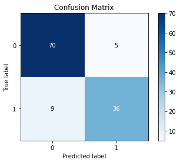

```python
import numpy as np
import pandas as pd
from logistic_rgr import LogisticRegression
import matplotlib.pyplot as plt
```

> Note: the implementation is in ```logistic_rgr.py``` file

## Reading the Data


```python
df = pd.read_csv('User_Data.csv')
df
```


<div>
<table border="1" class="dataframe">
  <thead>
    <tr style="text-align: right;">
      <th></th>
      <th>User ID</th>
      <th>Gender</th>
      <th>Age</th>
      <th>EstimatedSalary</th>
      <th>Purchased</th>
    </tr>
  </thead>
  <tbody>
    <tr>
      <th>0</th>
      <td>15624510</td>
      <td>Male</td>
      <td>19</td>
      <td>19000</td>
      <td>0</td>
    </tr>
    <tr>
      <th>1</th>
      <td>15810944</td>
      <td>Male</td>
      <td>35</td>
      <td>20000</td>
      <td>0</td>
    </tr>
    <tr>
      <th>2</th>
      <td>15668575</td>
      <td>Female</td>
      <td>26</td>
      <td>43000</td>
      <td>0</td>
    </tr>
    <tr>
      <th>3</th>
      <td>15603246</td>
      <td>Female</td>
      <td>27</td>
      <td>57000</td>
      <td>0</td>
    </tr>
    <tr>
      <th>4</th>
      <td>15804002</td>
      <td>Male</td>
      <td>19</td>
      <td>76000</td>
      <td>0</td>
    </tr>
    <tr>
      <th>...</th>
      <td>...</td>
      <td>...</td>
      <td>...</td>
      <td>...</td>
      <td>...</td>
    </tr>
    <tr>
      <th>395</th>
      <td>15691863</td>
      <td>Female</td>
      <td>46</td>
      <td>41000</td>
      <td>1</td>
    </tr>
    <tr>
      <th>396</th>
      <td>15706071</td>
      <td>Male</td>
      <td>51</td>
      <td>23000</td>
      <td>1</td>
    </tr>
    <tr>
      <th>397</th>
      <td>15654296</td>
      <td>Female</td>
      <td>50</td>
      <td>20000</td>
      <td>1</td>
    </tr>
    <tr>
      <th>398</th>
      <td>15755018</td>
      <td>Male</td>
      <td>36</td>
      <td>33000</td>
      <td>0</td>
    </tr>
    <tr>
      <th>399</th>
      <td>15594041</td>
      <td>Female</td>
      <td>49</td>
      <td>36000</td>
      <td>1</td>
    </tr>
  </tbody>
</table>
<p>400 rows × 5 columns</p>
</div>


## Preprocessing


```python
df.Purchased.value_counts()
```


    0    257
    1    143
    Name: Purchased, dtype: int64


#### dropping ```User ID``` and ```Gender``` cloumns


```python
df = df.drop(columns = ['User ID', 'Gender'])
```

#### extracting X(features) and y from the dataFrame


```python
X = df.iloc[:, :-1].to_numpy()
y = df.iloc[:, -1].to_numpy().reshape(-1, 1)
```

#### adding column of 1. to the features (x0 = 1.)


```python
X = np.c_[np.ones((X.shape[0], 1)), X]
```

#### splitting the data


```python
from sklearn.model_selection import train_test_split
X_train, X_tst, y_train, y_tst = train_test_split(X, y, test_size = 0.3, random_state = 0)
```

#### Standardizing the Features (essential for Logistic regression case)


```python
from sklearn.preprocessing import StandardScaler
scaler = StandardScaler()
X_train_std = scaler.fit_transform(X_train)
X_tst_std = scaler.transform(X_tst)
```

## Logistic Regression


```python
cls = LogisticRegression(n_iterations = 200, eta = 0.01)
```


```python
cls.fit(X_train_std, y_train)
```

    cost:  0.6931471805599466
    cost:  0.48821047560231634
    cost:  0.4589118756534972
    cost:  0.4473516135798214
    cost:  0.44154304666327837
    cost:  0.43825949472399167
    cost:  0.4362677499856426
    cost:  0.4350017672774965
    cost:  0.43417006417749426
    cost:  0.4336101879973917
    cost:  0.43322624217321215
    cost:  0.4329591117354987
    cost:  0.43277111246802447
    cost:  0.43263757684031673
    cost:  0.4325420111261145
    cost:  0.4324731950327643
    cost:  0.4324233868968112
    cost:  0.43238718234801043
    cost:  0.4323607717358559
    cost:  0.4323414475801424
    cost:  0.43232727246655944
    cost:  0.43231685197699565
    cost:  0.43230917757350784
    cost:  0.4323035167699557
    cost:  0.43229933568387396
    cost:  0.4322962440097582
    cost:  0.43229395566904744
    cost:  0.43229226051357533
    cost:  0.4322910038797925
    cost:  0.4322900717544568
    cost:  0.4322893799733206
    cost:  0.4322888663321853
    cost:  0.4322884848098028
    cost:  0.4322882013276155
    cost:  0.4322879906313719
    cost:  0.43228783399389903
    cost:  0.4322877175203151
    cost:  0.43228763089611405
    cost:  0.43228756646138444
    cost:  0.43228751852555825
    cost:  0.4322874828597847
    cost:  0.43228745632061877
    cost:  0.4322874365708978
    cost:  0.43228742187258434
    cost:  0.4322874109329606
    cost:  0.4322874027903875
    cost:  0.43228739672941885
    cost:  0.4322873922177152
    cost:  0.4322873888591421
    cost:  0.43228738635889746
    cost:  0.43228738449757353
    cost:  0.43228738311186665
    cost:  0.432287382080223
    cost:  0.43228738131216293
    cost:  0.4322873807403324
    cost:  0.43228738031459146
    cost:  0.4322873799976148
    cost:  0.43228737976161363
    cost:  0.4322873795859001
    cost:  0.43228737945507345
    cost:  0.43228737935766565
    cost:  0.43228737928513994
    cost:  0.4322873792311401
    cost:  0.4322873791909335
    cost:  0.43228737916099713
    cost:  0.43228737913870763
    cost:  0.43228737912211135
    cost:  0.43228737910975473
    cost:  0.4322873791005537
    cost:  0.4322873790937031
    cost:  0.432287379088602
    cost:  0.43228737908480425
    cost:  0.43228737908197623
    cost:  0.432287379079871
    cost:  0.4322873790783031
    cost:  0.43228737907713594
    cost:  0.4322873790762664
    cost:  0.43228737907561937
    cost:  0.43228737907513715
    cost:  0.43228737907477854
    cost:  0.43228737907451165
    cost:  0.43228737907431225
    cost:  0.43228737907416465
    cost:  0.43228737907405423
    cost:  0.4322873790739721
    cost:  0.432287379073911
    cost:  0.4322873790738655
    cost:  0.4322873790738317
    cost:  0.432287379073806
    cost:  0.4322873790737875
    cost:  0.4322873790737736
    cost:  0.4322873790737627
    cost:  0.4322873790737556
    cost:  0.4322873790737496
    cost:  0.4322873790737455
    cost:  0.43228737907374193
    cost:  0.43228737907373976
    cost:  0.4322873790737382
    cost:  0.43228737907373654
    cost:  0.4322873790737356
    cost:  0.4322873790737348
    cost:  0.4322873790737342
    cost:  0.4322873790737338
    cost:  0.43228737907373394
    cost:  0.4322873790737334
    cost:  0.4322873790737329
    cost:  0.432287379073733
    cost:  0.43228737907373305
    cost:  0.4322873790737331
    cost:  0.43228737907373294
    Converged to Cost:  0.43228737907373294 
    theta:  [0.         1.90786945 1.01337548]
    

## Evaluation


```python
y_pred = cls.predict(X_tst_std)
```


```python
y_pred
```


    array([0, 0, 0, 0, 0, 0, 0, 1, 0, 1, 0, 0, 0, 0, 0, 0, 0, 0, 1, 0, 0, 1,
           0, 1, 0, 1, 0, 0, 0, 0, 0, 0, 1, 0, 0, 0, 0, 0, 0, 1, 0, 0, 0, 0,
           1, 0, 0, 1, 0, 1, 1, 0, 0, 1, 1, 0, 0, 0, 1, 0, 0, 1, 0, 1, 0, 1,
           0, 0, 0, 1, 1, 0, 0, 0, 0, 0, 1, 0, 1, 1, 1, 1, 0, 0, 1, 1, 1, 1,
           1, 0, 1, 1, 0, 0, 0, 0, 0, 1, 1, 1, 0, 0, 0, 1, 1, 1, 0, 0, 0, 0,
           0, 0, 1, 1, 1, 1, 1, 0, 1, 1])


#### Confusion Matrix


```python
from sklearn.metrics import confusion_matrix
mat = confusion_matrix(y_pred, y_tst)
mat
```


    array([[70,  5],
           [ 9, 36]], dtype=int64)


```python
from scikitplot.metrics import plot_confusion_matrix
plot_confusion_matrix(y_pred, y_tst)
plt.show()
```


    

    


#### F1-score


```python
from sklearn.metrics import f1_score
f1_score(y_pred, y_tst)
```


    0.8372093023255814


